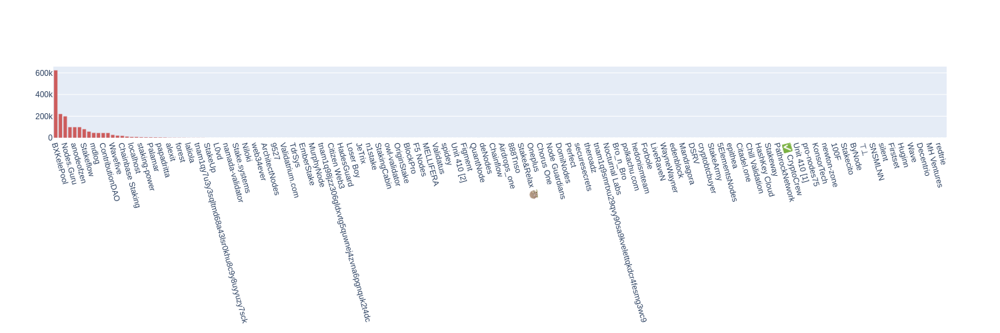

# Namada Mainnet Genesis files

The set of parameters and transactions that will create the namada genesis file.

If you have received an allocation, check the [docs on how to make a pre-genesis transaction.](https://docs.namada.net/networks/starting-network/genesis-flow/participants.html)

If you need help, feel free to [reach out on discord](https://discord.gg/AsPCKgW3)!

## Voting power distribution 

- Total validators: `191`
- Total delegations: `50`
- Staked tokens: `2432780.592579 (~0.24%)`

## Validators

- address: `tnam1qx7wyapm8f9ddlukz3p7gdmhjjvck7lmaqjeflra`
    - alias: `BXKelePool`
    - commission: `5.0%`
    - max commission rate change: `1.0%`
    - total voting power: `624900.0 (0.06%)`
    - email: `winlin@kelepool.com`
    - website: `https://www.kelepool.com`
    - total delegations: `1`

- address: `tnam1q829u6jedv7y4yek2gfrh77qaz9qe3veduzkdyk4`
    - alias: `Coverlet`
    - commission: `3.0%`
    - max commission rate change: `1.0%`
    - total voting power: `240000.0 (0.02%)`
    - email: `leon@coverlet.io`
    - website: `https://coverlet.io/`
    - total delegations: `1`

- address: `tnam1q8wldcr49mhm92a69fmf847d8rn48e6gcql2s4ya`
    - alias: `bitszn`
    - commission: `5.0%`
    - max commission rate change: `5.0%`
    - total voting power: `221600.0 (0.02%)`
    - email: `bitszn.com@gmail.com`
    - website: `https://bitszn.com`
    - total delegations: `1`

- address: `tnam1q9rq7p4wzy6fea96xs5sr8qnsxsfdr2zugfsvw2n`
    - alias: `Nodes.Guru`
    - commission: `5.0%`
    - max commission rate change: `1.0%`
    - total voting power: `200000.0 (0.02%)`
    - email: `security@nodes.guru`
    - website: `https://nodes.guru`
    - total delegations: `1`

- address: `tnam1qy500vdqtcumxzfhjccrhdx9j9wawhsyg536thwn`
    - alias: `anodeofzen`
    - commission: `5.0%`
    - max commission rate change: `1.0%`
    - total voting power: `100000.0 (0.01%)`
    - email: `zenodeapp@gmail.com`
    - website: `https://zenode.app`
    - total delegations: `1`

- address: `tnam1q8yksf6xqm6u8e2axhy7wyx0elslnh7tdsrp2y9m`
    - alias: `HadesGuard`
    - commission: `5.0%`
    - max commission rate change: `1.0%`
    - total voting power: `100000.0 (0.01%)`
    - email: `truongquoctuan61@gmail.com`
    - website: `Unknown website`
    - total delegations: `1`

- address: `tnam1q8xasrt0q8qrkqj5s9r9xw3ee0gx5mqwyukhe699`
    - alias: `Cosmic Validator`
    - commission: `5.0%`
    - max commission rate change: `1.0%`
    - total voting power: `100000.0 (0.01%)`
    - email: `info@cosmicvalidator.com`
    - website: `https://www.cosmicvalidator.com`
    - total delegations: `1`

- address: `tnam1qx64zytr93rjj23ztf32y2rnrxwlm9j6svyznxez`
    - alias: `CroutonDigital`
    - commission: `5.0%`
    - max commission rate change: `1.0%`
    - total voting power: `100000.0 (0.01%)`
    - email: `official@crouton.digital`
    - website: `https:/crouton.digital`
    - total delegations: `1`

- address: `tnam1q99e0kqh32q6s3f3mr0ds772edyg7862jgj23fhh`
    - alias: `Unknown alias`
    - commission: `5.0%`
    - max commission rate change: `1.0%`
    - total voting power: `100000.0 (0.01%)`
    - email: `fastrpl@gmail.com`
    - website: `https://itrocket.net/`
    - total delegations: `1`

- address: `tnam1q8jrrf8s22cwd22yxhwc38tlvahplh2wyqjzl9gx`
    - alias: `P2P.org 💙`
    - commission: `4.5%`
    - max commission rate change: `2.5%`
    - total voting power: `84759.0 (0.01%)`
    - email: `cosmos-security@p2p.org`
    - website: `https://p2p.org/`
    - total delegations: `2`

- address: `tnam1q93th4stcuxfs0h8kn9uw0uhdj59dfa5hu768v4t`
    - alias: `Stakeflow`
    - commission: `7.000000000000001%`
    - max commission rate change: `1.0%`
    - total voting power: `81500.0 (0.01%)`
    - email: `team@stakeflow.io`
    - website: `https://validator.stakeflow.io`
    - total delegations: `1`

- address: `tnam1q9sdarpylwxd5vv3e8u6wstrpz052jhls5g4a3wg`
    - alias: `Swiss Staking`
    - commission: `0.0%`
    - max commission rate change: `2.5%`
    - total voting power: `59240.0 (0.01%)`
    - email: `info@swiss-staking.ch`
    - website: `https://swiss-staking.ch`
    - total delegations: `3`

- address: `tnam1q9mgfvqqypw82jk997kzgkkgnf8fxur2qqpa7rlr`
    - alias: `mdlog`
    - commission: `5.0%`
    - max commission rate change: `1.0%`
    - total voting power: `47726.0 (0.0%)`
    - email: `adiadi2411@gmail.com`
    - website: `mdnodes.com`
    - total delegations: `1`

- address: `tnam1q8qkkdq9wvpk0udfaf64cswzpnwe033jpvcmrxz6`
    - alias: `DTEAM`
    - commission: `5.0%`
    - max commission rate change: `1.0%`
    - total voting power: `46600.0 (0.0%)`
    - email: `contact@dteam.tech`
    - website: `https://dteam.tech/`
    - total delegations: `1`

- address: `tnam1qy07wl9ds2kl4cfew0426jv4qlzx7kh9pqft7ltr`
    - alias: `ContributionDAO`
    - commission: `5.0%`
    - max commission rate change: `1.0%`
    - total voting power: `46600.0 (0.0%)`
    - email: `security@contributiondao.com`
    - website: `https://contributiondao.com`
    - total delegations: `1`

- address: `tnam1qxuv9e6rx0stfz7e842q4uwmpcexh50765qqw9ns`
    - alias: `kjnodes.com 🦄`
    - commission: `5.0%`
    - max commission rate change: `1.0%`
    - total voting power: `46566.67 (0.0%)`
    - email: `contact@kjnodes.com`
    - website: `https://services.kjnodes.com/mainnet/namada`
    - total delegations: `1`

- address: `tnam1qy0zrla88txv244suxaruqgr9g74vr8vyufd8rp7`
    - alias: `Wavefive`
    - commission: `4.0%`
    - max commission rate change: `2.0%`
    - total voting power: `29000.0 (0.0%)`
    - email: `hello@wavefive.co`
    - website: `https://wavefive.co`
    - total delegations: `1`

- address: `tnam1qyd33xrjdpr3hwhy0ckut7lk56gd5gjflgtul8hs`
    - alias: `AutoStake`
    - commission: `0.0%`
    - max commission rate change: `1.0%`
    - total voting power: `22300.0 (0.0%)`
    - email: `support@autostake.com`
    - website: `autostake.com`
    - total delegations: `1`

- address: `tnam1qxfcew76uclxuf5a5qkhwdtt8m6enc58tsqnwupd`
    - alias: `IRISnet`
    - commission: `8.0%`
    - max commission rate change: `6.0%`
    - total voting power: `21680.0 (0.0%)`
    - email: `bob@irisnet.org`
    - website: `https://irisnet.org`
    - total delegations: `1`

- address: `tnam1q9ude2ceqdj8dk6z3rwxnykm446j5lfkwy747kzp`
    - alias: `Chainbase Staking`
    - commission: `5.0%`
    - max commission rate change: `2.0%`
    - total voting power: `19990.0 (0.0%)`
    - email: `staking@chainbase.com`
    - website: `https://staking.chainbase.com`
    - total delegations: `1`

- address: `tnam1q9hafe0nf5k7pnkcmzp4tezgux6v7a6r25yqfe60`
    - alias: `Oneplus`
    - commission: `5.0%`
    - max commission rate change: `1.0%`
    - total voting power: `15000.0 (0.0%)`
    - email: `oneplus9159@gmail.com`
    - website: `Unknown website`
    - total delegations: `1`

- address: `tnam1qy3m25cx7gd67vyz5px5wjj5gcy4pfhnnux9mhcr`
    - alias: `CryptoSJnet`
    - commission: `5.0%`
    - max commission rate change: `1.0%`
    - total voting power: `13337.0 (0.0%)`
    - email: `m@cryptosj.net`
    - website: `https://cryptosj.net`
    - total delegations: `1`

- address: `tnam1qyx8wdefdg9sd6e22xq8ccyqg5peaersvcm20843`
    - alias: `securesecrets`
    - commission: `1.0%`
    - max commission rate change: `1.0%`
    - total voting power: `10100.0 (0.0%)`
    - email: `mohammedp@securesecrets.org`
    - website: `https://securesecrets.org`
    - total delegations: `2`

- address: `tnam1qx58wny2k2tekhafrnujz7fnn44lg2y24cs8zquu`
    - alias: `localhost`
    - commission: `5.0%`
    - max commission rate change: `1.0%`
    - total voting power: `10000.0 (0.0%)`
    - email: `llocallhost@gmail.com`
    - website: `Unknown website`
    - total delegations: `1`

- address: `tnam1q8ww8zgchxju5dr55tl2xqgfh3vwsh8kh53gkp2f`
    - alias: `zaebaza`
    - commission: `5.0%`
    - max commission rate change: `1.0%`
    - total voting power: `10000.0 (0.0%)`
    - email: `zaebaza@rambler.ru`
    - website: `private`
    - total delegations: `1`

- address: `tnam1qyp32zcympg4vlkmu72u33szdgv6qcf3vgrr8w3j`
    - alias: `MekongLabs`
    - commission: `5.0%`
    - max commission rate change: `1.0%`
    - total voting power: `10000.0 (0.0%)`
    - email: `nguyen@mekonglabs.tech`
    - website: `https://mekonglabs.tech`
    - total delegations: `1`

- address: `tnam1q9pt4hukg0ga362jq2slhg4tuf692zqqngzzz54k`
    - alias: `Stakecito`
    - commission: `5.0%`
    - max commission rate change: `2.0%`
    - total voting power: `9999.0 (0.0%)`
    - email: `security@stakecito.de`
    - website: `https://www.stakecito.com`
    - total delegations: `1`

- address: `tnam1q83gqj9fpny50g7pclc62wu7qxjc7mdlwvq5s2ca`
    - alias: `staking-power`
    - commission: `5.0%`
    - max commission rate change: `1.0%`
    - total voting power: `7295.0 (0.0%)`
    - email: `aquariusluo@gmail.com`
    - website: `www.staking-power.com`
    - total delegations: `1`

- address: `tnam1q86ydne27sxc4tzgzy5wcv9mwrwa0gwtqg4rfuue`
    - alias: `Moonode`
    - commission: `5.0%`
    - max commission rate change: `1.0%`
    - total voting power: `6769.0 (0.0%)`
    - email: `bngq323@outlook.com`
    - website: `Unknown website`
    - total delegations: `1`

- address: `tnam1q8re97lpfp5kmj5nu3t5sxvlp8yydnfjkuzw76dp`
    - alias: `Palamar`
    - commission: `5.0%`
    - max commission rate change: `1.0%`
    - total voting power: `6666.0 (0.0%)`
    - email: `admin@palamar.io`
    - website: `https://palamar.io`
    - total delegations: `1`

- address: `tnam1q973h5dwpl0wv4t8zy9gmafllmrnalde0vek58zq`
    - alias: `Cypher Core`
    - commission: `10.0%`
    - max commission rate change: `1.0%`
    - total voting power: `6300.0 (0.0%)`
    - email: `admin@cyphercore.io`
    - website: `https://cyphercore.io`
    - total delegations: `1`

- address: `tnam1q8g86hqz3rajj5p64pf22zmlvp9lkd976ufpz7mc`
    - alias: `Igor_Gusarov`
    - commission: `3.0%`
    - max commission rate change: `1.0%`
    - total voting power: `6200.0 (0.0%)`
    - email: `igrgusarov@gmail.com`
    - website: `Unknown website`
    - total delegations: `1`

- address: `tnam1qy8470ge8g608l69t0qt0g6ulmxnsckr9s74ew4j`
    - alias: `papadritta`
    - commission: `5.0%`
    - max commission rate change: `1.0%`
    - total voting power: `5555.0 (0.0%)`
    - email: `papadritta@gmail.com`
    - website: `https://github.com/papadritta`
    - total delegations: `1`

- address: `tnam1q8dtazgc7y9xx00lq4d2pnacvtz29p5mvcxwat74`
    - alias: `Staking4All`
    - commission: `1.0%`
    - max commission rate change: `5.0%`
    - total voting power: `4900.0 (0.0%)`
    - email: `info@staking4all.org`
    - website: `https://www.staking4all.org/`
    - total delegations: `1`

- address: `tnam1q8g669anlgcd490mfdqct8v734ekr7zu2ywgjwqc`
    - alias: `Staketab`
    - commission: `5.0%`
    - max commission rate change: `1.0%`
    - total voting power: `3120.0 (0.0%)`
    - email: `partners@staketab.com`
    - website: `https://staketab.com/`
    - total delegations: `1`

- address: `tnam1q83z54q574kvzfujk5dt9kpy42a4zpassueswgyq`
    - alias: `alexit`
    - commission: `5.0%`
    - max commission rate change: `1.0%`
    - total voting power: `3000.0 (0.0%)`
    - email: `alex.it.prof@gmail.com`
    - website: `https://github.com/AlexITProf`
    - total delegations: `1`

- address: `tnam1qxtfny8cngyyf0ms2fl6rcu65lt0da0ns5a3gxrq`
    - alias: `Vitwit`
    - commission: `5.0%`
    - max commission rate change: `1.0%`
    - total voting power: `2500.0 (0.0%)`
    - email: `validators@vitwit.com`
    - website: `https://vitwit.com`
    - total delegations: `1`

- address: `tnam1qxlahm9qqxqhyjezsxvrpkn9ajekrkg2xq5v8rz8`
    - alias: `forest`
    - commission: `5.0%`
    - max commission rate change: `1.0%`
    - total voting power: `2333.0 (0.0%)`
    - email: `yarco@pragma.ooo`
    - website: `https://pragma.ooo`
    - total delegations: `1`

- address: `tnam1qxkkaflgfr6c7crvj4jwshy99zsdw346nv4ay0rn`
    - alias: `NomadValidator`
    - commission: `5.0%`
    - max commission rate change: `10.0%`
    - total voting power: `1999.0 (0.0%)`
    - email: `nomad@nomadvalidator.com`
    - website: `www.nomadvalidator.com`
    - total delegations: `1`

- address: `tnam1q9ys6rx7h9d20a5gq0dewx6uze6k2trxayt90zf3`
    - alias: `Unknown alias`
    - commission: `5.0%`
    - max commission rate change: `1.0%`
    - total voting power: `1010.0 (0.0%)`
    - email: `mus56@mail.ru`
    - website: `Unknown website`
    - total delegations: `1`

- address: `tnam1qx7xenrcve38c8lmcmewpk42df6pchlyjg34d3lq`
    - alias: `SIPALING-TESTNET`
    - commission: `10.0%`
    - max commission rate change: `1.0%`
    - total voting power: `1000.0 (0.0%)`
    - email: `sptnode@gmail.com`
    - website: `https://node.sipalingtestnet.com/`
    - total delegations: `1`

- address: `tnam1qy7u3y3sqltmd68a43lsr0khu8c9y8uyyuzy7sck`
    - alias: `Unknown alias`
    - commission: `5.0%`
    - max commission rate change: `1.0%`
    - total voting power: `1000.0 (0.0%)`
    - email: `support@gatadao.zone`
    - website: `https://gatahub.zone`
    - total delegations: `1`

- address: `tnam1qx635ya9l2yz3ua92kckrad4v2p59madpspm9dtg`
    - alias: `Disperze`
    - commission: `5.0%`
    - max commission rate change: `1.0%`
    - total voting power: `1000.0 (0.0%)`
    - email: `blocks@disperze.network`
    - website: `https://disperze.network`
    - total delegations: `1`

- address: `tnam1qysez03jadg5uann2vpr3tdap3ahyfl2hv0kg085`
    - alias: `laliola`
    - commission: `5.0%`
    - max commission rate change: `1.0%`
    - total voting power: `1000.0 (0.0%)`
    - email: `sale.laliola@gmail.com`
    - website: `https://github.com/JuliaMoon1`
    - total delegations: `1`

- address: `tnam1qydvhqdu2q2vrgvju2ngpt6yhrehu525pus6m28p`
    - alias: `Kintsugi Nodes`
    - commission: `2.0%`
    - max commission rate change: `1.0%`
    - total voting power: `135.922579 (0.0%)`
    - email: `info@kintsugi.tech`
    - website: `https://kintsugi.tech`
    - total delegations: `1`

- address: `tnam1q9vdxnkrqwnw5vrgfypqz6ndejp6sy2sfgc9pk5d`
    - alias: `Nodeify`
    - commission: `5.0%`
    - max commission rate change: `1.0%`
    - total voting power: `100.0 (0.0%)`
    - email: `admin@nodeify.net`
    - website: `https://nodeify.net`
    - total delegations: `1`

- address: `tnam1q9tf86cusctv2c679ssflsrq0ymd9qxnluuewvt8`
    - alias: `Tecnodes`
    - commission: `5.0%`
    - max commission rate change: `1.0%`
    - total voting power: `0 (0.0%)`
    - email: `tecnodes.network@gmail.com`
    - website: `https://tecnodes.network`
    - total delegations: `0`

- address: `tnam1q9mnn2qkg3fzuw8hzwgnuxa42rvdjhkn5s065aa3`
    - alias: `stake-machine`
    - commission: `5.0%`
    - max commission rate change: `1.0%`
    - total voting power: `0 (0.0%)`
    - email: `iam@stake-machine.com`
    - website: `https://stake-machine.com`
    - total delegations: `0`

- address: `tnam1qx405kgvey8wwfcyt7rgsr4nvkrqsnztxs2kz7wv`
    - alias: `PathrockNetwork`
    - commission: `5.0%`
    - max commission rate change: `1.0%`
    - total voting power: `0 (0.0%)`
    - email: `pathrock@protonmail.com`
    - website: `https://pathrocknetwork.org/`
    - total delegations: `0`

- address: `tnam1qx5psh6xca8n4ezukdy5yynhtr3a6m65lv54ms3p`
    - alias: `newton-zone`
    - commission: `5.0%`
    - max commission rate change: `5.0%`
    - total voting power: `0 (0.0%)`
    - email: `namada@newton.zone`
    - website: `https://newton.zone`
    - total delegations: `0`

- address: `tnam1q87f9g34lagl5e6y482fwtad7870rk4vzsqaq7mf`
    - alias: `L0vd`
    - commission: `0.0%`
    - max commission rate change: `5.0%`
    - total voting power: `0 (0.0%)`
    - email: `info@l0vd.com`
    - website: `https://l0vd.com`
    - total delegations: `0`

- address: `tnam1qyd9xx4cw4knl4accyp2epnrfk6fgc3kgqxrzndv`
    - alias: `MathNodes`
    - commission: `3.1399999999999997%`
    - max commission rate change: `3.0%`
    - total voting power: `0 (0.0%)`
    - email: `support@mathnodes.com`
    - website: `https://mathnodes.com`
    - total delegations: `0`

- address: `tnam1qxl39v5a88cm0cw842mv7znmygmz4etfa5d5raze`
    - alias: `Brightlystake`
    - commission: `7.000000000000001%`
    - max commission rate change: `1.0%`
    - total voting power: `0 (0.0%)`
    - email: `contact@brightlystake.com`
    - website: `https://brightlystake.com`
    - total delegations: `0`

- address: `tnam1q8590sez2sxwta6f6fsydwjxgkctvtu0lsgu7702`
    - alias: `StakingCabin`
    - commission: `5.0%`
    - max commission rate change: `1.0%`
    - total voting power: `0 (0.0%)`
    - email: `richard@stakingcabin.com`
    - website: `https://stakingcabin.com`
    - total delegations: `0`

- address: `tnam1qxr8n7u36jcf82d0ccp0flshpwhz3d3xjv5ryn44`
    - alias: `ZKV`
    - commission: `10.0%`
    - max commission rate change: `1.0%`
    - total voting power: `0 (0.0%)`
    - email: `hello@zkvalidator.com`
    - website: `https://zkv.xyz/`
    - total delegations: `0`

- address: `tnam1q96knx9lhndg9749waeqq974zyqxz8yv0slmy39v`
    - alias: `⊤⊥`
    - commission: `5.0%`
    - max commission rate change: `1.0%`
    - total voting power: `0 (0.0%)`
    - email: `unitylchaos@protonmail.com`
    - website: `https://s9.gay`
    - total delegations: `0`

- address: `tnam1qysxqwyeldesm2cdfhkr86jky5vj5vu8cu9jjqtw`
    - alias: `cryptech`
    - commission: `5.0%`
    - max commission rate change: `1.0%`
    - total voting power: `0 (0.0%)`
    - email: `cryptech.nodes@gmail.com`
    - website: `https://services.cryptech.com.ua`
    - total delegations: `0`

- address: `tnam1qyplu8gruqmmvwp7x7kd92m6x4xpyce265fa05r6`
    - alias: `Grand Valley`
    - commission: `5.0%`
    - max commission rate change: `5.0%`
    - total voting power: `0 (0.0%)`
    - email: `cobajohnson90@gmail.com`
    - website: `https://github.com/hubofvalley`
    - total delegations: `0`

- address: `tnam1qy9htx7f43s3g4220ljzmua65vp5sw9ah5vm6xdu`
    - alias: `Firstset`
    - commission: `5.0%`
    - max commission rate change: `1.0%`
    - total voting power: `0 (0.0%)`
    - email: `hi@firstset.xyz`
    - website: `https://firstset.xyz`
    - total delegations: `0`

- address: `tnam1q98n27gcgnwxxvurcruyvfge0fenczw6nuf7re5n`
    - alias: `MH Ventures`
    - commission: `5.0%`
    - max commission rate change: `1.0%`
    - total voting power: `0 (0.0%)`
    - email: `info@mhventures.io`
    - website: `https://mhventures.io`
    - total delegations: `0`

- address: `tnam1q8qr408fvssqpqaht2qspryq2yfu7lds0urktcam`
    - alias: `Simply Staking`
    - commission: `5.0%`
    - max commission rate change: `1.0%`
    - total voting power: `0 (0.0%)`
    - email: `staking@simplystaking.com`
    - website: `https://simplystaking.com`
    - total delegations: `0`

- address: `tnam1q9gvv99t25xam0tq0vg4x77a64tztm320gclvafy`
    - alias: `Coinage x DAIC`
    - commission: `5.0%`
    - max commission rate change: `1.0%`
    - total voting power: `0 (0.0%)`
    - email: `office@daic.capital`
    - website: `https://daic.capital`
    - total delegations: `0`

- address: `tnam1qya90eeuaxn47ajfjp08f8zzgjtmhy0lmyxn26gu`
    - alias: `TuDudes`
    - commission: `5.0%`
    - max commission rate change: `1.0%`
    - total voting power: `0 (0.0%)`
    - email: `node-alerts@tududes.com`
    - website: `https://tududes.com`
    - total delegations: `0`

- address: `tnam1q96m7kwchdgzjk7dpvxkq3dxwzjhyjcggyuua5xf`
    - alias: `StakeUp`
    - commission: `5.0%`
    - max commission rate change: `1.0%`
    - total voting power: `0 (0.0%)`
    - email: `info@stakeup.tech`
    - website: `https://stakeup.tech`
    - total delegations: `0`

- address: `tnam1qx4ztg0ca0tu2aw056ksuek5y58tmg454shk6svw`
    - alias: `5ElementsNodes`
    - commission: `10.0%`
    - max commission rate change: `5.0%`
    - total voting power: `0 (0.0%)`
    - email: `security@5elementsnodes.com`
    - website: `https://www.5elementsnodes.com`
    - total delegations: `0`

- address: `tnam1q89xnpnrfsefr9ynj4v8ngdu35me8xudzgn94afm`
    - alias: `Enigma`
    - commission: `5.0%`
    - max commission rate change: `1.0%`
    - total voting power: `0 (0.0%)`
    - email: `contact@enigma-validator.com`
    - website: `https://enigma-validator.com/`
    - total delegations: `0`

- address: `tnam1qxepvwg3c24kv0ltlkaasxscy3fsk89h8vrwzgd7`
    - alias: `Bro_n_Bro`
    - commission: `5.0%`
    - max commission rate change: `1.0%`
    - total voting power: `0 (0.0%)`
    - email: `bro.n.bro.foundation@gmail.com`
    - website: `bronbro.io`
    - total delegations: `0`

- address: `tnam1q8wp34dknmcl84t46pk7syjwz7ys36ppksxg6xsc`
    - alias: `ChainLayer`
    - commission: `5.0%`
    - max commission rate change: `1.0%`
    - total voting power: `0 (0.0%)`
    - email: `hello@chainlayer.io`
    - website: `https://chainlayer.io`
    - total delegations: `0`

- address: `tnam1qxzwta6uhcsv40a8l4g5t07q0ey50c9dlyt3s272`
    - alias: `polkachu.com`
    - commission: `5.0%`
    - max commission rate change: `1.0%`
    - total voting power: `0 (0.0%)`
    - email: `hello@polkachu.com`
    - website: `https://polkachu.com`
    - total delegations: `0`

- address: `tnam1q985emxj29hpz3dlye0yfe5hm66pmwqalu0y06p4`
    - alias: `Encapsulate (fka KingSuper)`
    - commission: `5.0%`
    - max commission rate change: `4.0%`
    - total voting power: `0 (0.0%)`
    - email: `security@encapsulate.xyz`
    - website: `https://encapsulate.xyz`
    - total delegations: `0`

- address: `tnam1qys6lkycftrwxzcge00c3ezgegrqf7pdkqu83zx2`
    - alias: `DWG`
    - commission: `5.0%`
    - max commission rate change: `1.0%`
    - total voting power: `0 (0.0%)`
    - email: `nnathantaylor12@gmail.com`
    - website: `Unknown website`
    - total delegations: `0`

- address: `tnam1qxc286h5qmx9x2vdv8k9gy0ll878gna9dgy4rv40`
    - alias: `TdrSys`
    - commission: `5.0%`
    - max commission rate change: `1.0%`
    - total voting power: `0 (0.0%)`
    - email: `contact@tdrsys.com`
    - website: `https://www.tdrsys.com`
    - total delegations: `0`

- address: `tnam1qyxp2w0e006nwr3ln9gxcvpnypcx40857ytfgyyt`
    - alias: `Wave`
    - commission: `5.0%`
    - max commission rate change: `1.0%`
    - total voting power: `0 (0.0%)`
    - email: `contact@0xwave.com`
    - website: `https://0xwave.com`
    - total delegations: `0`

- address: `tnam1q9wgwx9zwmcawup0w2tdllt6pwyad87szuc4f7wq`
    - alias: `Loser Boy`
    - commission: `5.0%`
    - max commission rate change: `1.0%`
    - total voting power: `0 (0.0%)`
    - email: `loser@loserboy.xyz`
    - website: `https://loserboy.xyz`
    - total delegations: `0`

- address: `tnam1qyl2fc8c358avg47ff5lkc47d4cnk0x8wy96ax9q`
    - alias: `StakePool`
    - commission: `1.0%`
    - max commission rate change: `1.0%`
    - total voting power: `0 (0.0%)`
    - email: `contact@stakepool.dev.br`
    - website: `https://stakepool.dev.br/`
    - total delegations: `0`

- address: `tnam1q8236gr76rrsluvq27j8mkma8u04hz0khszatckw`
    - alias: `ValidatorVN`
    - commission: `5.0%`
    - max commission rate change: `5.0%`
    - total voting power: `0 (0.0%)`
    - email: `admin@validatorvn.com`
    - website: `https://validatorvn.com`
    - total delegations: `0`

- address: `tnam1qyep6245as3ar6a6ymk9tvsd6rhdnkr9rgx8mnwl`
    - alias: `Unit 410 [2]`
    - commission: `20.0%`
    - max commission rate change: `0.0%`
    - total voting power: `0 (0.0%)`
    - email: `security@unit410.com`
    - website: `https://unit410.com`
    - total delegations: `0`

- address: `tnam1qx2xz8ggmzgfgkj5n33fzumq3lept6hf7yqxcrex`
    - alias: `deNodes`
    - commission: `5.0%`
    - max commission rate change: `1.0%`
    - total voting power: `0 (0.0%)`
    - email: `core@denodes.xyz`
    - website: `https://denodes.xyz`
    - total delegations: `0`

- address: `tnam1qy5dqyv2ygrk2sm84mj0pdl0ralx5wurwu8xz3qa`
    - alias: `cosmowiz`
    - commission: `5.0%`
    - max commission rate change: `1.0%`
    - total voting power: `0 (0.0%)`
    - email: `cto@cosmowiz.com`
    - website: `https://cosmowiz.com`
    - total delegations: `0`

- address: `tnam1q8rrg8slcx6c8z0zq4tdkmtpq6ljmcytxgd3wktz`
    - alias: `bigpaopao`
    - commission: `5.0%`
    - max commission rate change: `1.0%`
    - total voting power: `0 (0.0%)`
    - email: `bigpaopao@outlook.com`
    - website: `Unknown website`
    - total delegations: `0`

- address: `tnam1q9zvl5nzd2np5mdgfa2lzccaey4xln55ku3mdlws`
    - alias: `maragung`
    - commission: `5.0%`
    - max commission rate change: `1.0%`
    - total voting power: `0 (0.0%)`
    - email: `0xmaragung@gmail.com`
    - website: `https://maragung.com`
    - total delegations: `0`

- address: `tnam1q8jpmstfc07lkj9tu7un9c76h69kfsfsmyqs9clv`
    - alias: `UbikCapital`
    - commission: `5.0%`
    - max commission rate change: `1.0%`
    - total voting power: `0 (0.0%)`
    - email: `contact@ubik.capital`
    - website: `https://ubik.capital/`
    - total delegations: `0`

- address: `tnam1qx03fx58wtm6e2g5yt4uu9jpy702h4pjuy9a7653`
    - alias: `Infraspear`
    - commission: `5.0%`
    - max commission rate change: `1.0%`
    - total voting power: `0 (0.0%)`
    - email: `admin@infraspear.com`
    - website: `Unknown website`
    - total delegations: `0`

- address: `tnam1qy93z8ek2wwm3l3nd9gl872n2argnjfrwstywpmj`
    - alias: `project blanc`
    - commission: `5.0%`
    - max commission rate change: `1.0%`
    - total voting power: `0 (0.0%)`
    - email: `it@projectblanc.ch`
    - website: `https://blanc.group/`
    - total delegations: `0`

- address: `tnam1qyxd5eh0mf49at77dursxnlsygn5se6d45tj5y47`
    - alias: `✅ CryptoCrew`
    - commission: `5.0%`
    - max commission rate change: `1.0%`
    - total voting power: `0 (0.0%)`
    - email: `support@ccvalidators.com`
    - website: `https://ccvalidators.com`
    - total delegations: `0`

- address: `tnam1qyf80vw4e8aa2efuk4jsg9lpwxrntsj2dql4tssa`
    - alias: `Crypto Universe`
    - commission: `5.0%`
    - max commission rate change: `1.0%`
    - total voting power: `0 (0.0%)`
    - email: `contact.crypto.universe@gmail.com`
    - website: `Unknown website`
    - total delegations: `0`

- address: `tnam1q8vztqtl5aknthxa3jezezr7amkgz3zp5vz82qe5`
    - alias: `Validatus`
    - commission: `5.0%`
    - max commission rate change: `1.0%`
    - total voting power: `0 (0.0%)`
    - email: `support@validatus.com`
    - website: `https://www.validatus.com`
    - total delegations: `0`

- address: `tnam1q8s7jp43sezdmp07g5jn45wd9wdx9ygkgqwr2grj`
    - alias: `zxx`
    - commission: `5.0%`
    - max commission rate change: `1.0%`
    - total voting power: `0 (0.0%)`
    - email: `2094174328@qq.com`
    - website: `Unknown website`
    - total delegations: `0`

- address: `tnam1q9krl9ltzmwj6m4q60ugnmrz3uwnm450ayt42h7v`
    - alias: `PowerStaking`
    - commission: `5.0%`
    - max commission rate change: `1.0%`
    - total voting power: `0 (0.0%)`
    - email: `an0drei83@gmail.com`
    - website: `https://powerstaking.tech`
    - total delegations: `0`

- address: `tnam1q9xecndf4dpp83v393myhlzzs2g7g7df2c9cdzll`
    - alias: `StakeArmy`
    - commission: `5.0%`
    - max commission rate change: `1.0%`
    - total voting power: `0 (0.0%)`
    - email: `stakearmy@gmail.com`
    - website: `https://stakearmy.com`
    - total delegations: `0`

- address: `tnam1q8wq9ns3v5fhxeu8uedtfavn07w9wvt4ygp0ajgs`
    - alias: `Stakeway`
    - commission: `5.0%`
    - max commission rate change: `1.0%`
    - total voting power: `0 (0.0%)`
    - email: `staking@gateway.fm`
    - website: `https://stakeway.com`
    - total delegations: `0`

- address: `tnam1q8tzr86aw8kh2f66vukkhnghppkp0xckdy3xzrgx`
    - alias: `Unknown alias`
    - commission: `5.0%`
    - max commission rate change: `1.0%`
    - total voting power: `0 (0.0%)`
    - email: `office@noders.team`
    - website: `Unknown website`
    - total delegations: `0`

- address: `tnam1q8vzrsmuy3av4t5354u07350lsyksg6w7s60tr6f`
    - alias: `redtrie`
    - commission: `0.0%`
    - max commission rate change: `2.0%`
    - total voting power: `0 (0.0%)`
    - email: `joseph@redtrie.com`
    - website: `Unknown website`
    - total delegations: `0`

- address: `tnam1qygn0qw0knlguygtxz6hgrluxhu5kt9a8vqvtj36`
    - alias: `Peach`
    - commission: `5.0%`
    - max commission rate change: `1.0%`
    - total voting power: `0 (0.0%)`
    - email: `81279589@qq.com`
    - website: `Unknown website`
    - total delegations: `0`

- address: `tnam1q9cfj43flxq0tlh4vlaymjcea9g5mm2qhqls99ky`
    - alias: `Nocturnal Labs`
    - commission: `5.0%`
    - max commission rate change: `1.0%`
    - total voting power: `0 (0.0%)`
    - email: `connect@nocturnallabs.org`
    - website: `https://nocturnallabs.org`
    - total delegations: `0`

- address: `tnam1qymvjx342ns6qqx0cyhxwrqumjphcfuk9yp0eywf`
    - alias: `Chill Validation`
    - commission: `5.0%`
    - max commission rate change: `1.0%`
    - total voting power: `0 (0.0%)`
    - email: `chillvalidation@gmail.com`
    - website: `https://chillvalidation.com`
    - total delegations: `0`

- address: `tnam1qx7apjd6puv09zenlgcjg5q9l74y6ax4sqvyhp6y`
    - alias: `Luganodes`
    - commission: `10.0%`
    - max commission rate change: `1.0%`
    - total voting power: `0 (0.0%)`
    - email: `devops@luganodes.com`
    - website: `https://www.luganodes.com/`
    - total delegations: `0`

- address: `tnam1q98jzz306gldxvtg5quwnej4zvna6pgnquk2t4dc`
    - alias: `Unknown alias`
    - commission: `5.0%`
    - max commission rate change: `1.0%`
    - total voting power: `0 (0.0%)`
    - email: `paul@everlasting.nz`
    - website: `Unknown website`
    - total delegations: `0`

- address: `tnam1q96k4cmpem5n6tun5qap7vqfxv5fx9hzucp8lqt0`
    - alias: `Unknown alias`
    - commission: `5.0%`
    - max commission rate change: `5.0%`
    - total voting power: `0 (0.0%)`
    - email: `infra@poeticte.ch`
    - website: `Unknown website`
    - total delegations: `0`

- address: `tnam1qyfmtehvnrrcwtjueygvvqrwy43dtw3r9uwe5tf7`
    - alias: `Stake.systems`
    - commission: `5.0%`
    - max commission rate change: `1.0%`
    - total voting power: `0 (0.0%)`
    - email: `davidthepopescu@gmail.com`
    - website: `https://stake.systems`
    - total delegations: `0`

- address: `tnam1qxyx90jvjew6ng5tgpfgfhwrt4g4atg7kq9u7wly`
    - alias: `IONode Vietnam ✅`
    - commission: `5.0%`
    - max commission rate change: `10.0%`
    - total voting power: `0 (0.0%)`
    - email: `ionodeonline@gmail.com`
    - website: `https://IONode.Online`
    - total delegations: `0`

- address: `tnam1q9nddtsaw5xeptrdx72ruaxx0ry53sur3gy5cvsq`
    - alias: `web34ever`
    - commission: `5.0%`
    - max commission rate change: `1.0%`
    - total voting power: `0 (0.0%)`
    - email: `web34ever@gmail.com`
    - website: `https://web3validator.info`
    - total delegations: `0`

- address: `tnam1q98q7w76n3hyy5yw9xklm5xvhzeh5gyz7qy0kc2v`
    - alias: `9527`
    - commission: `5.0%`
    - max commission rate change: `1.0%`
    - total voting power: `0 (0.0%)`
    - email: `gomerflinkt@hotmail.com`
    - website: `Unknown website`
    - total delegations: `0`

- address: `tnam1q8usghsv57lyfr26wtpyx9ry8v5h9lq63uakqupt`
    - alias: `epithea`
    - commission: `0.0%`
    - max commission rate change: `2.0%`
    - total voting power: `0 (0.0%)`
    - email: `admin@epithea.com`
    - website: `Unknown website`
    - total delegations: `0`

- address: `tnam1qyw3amnxak8hthan0agj8rwrlhwc8r5ztqrvf3pz`
    - alias: `rch`
    - commission: `5.0%`
    - max commission rate change: `1.0%`
    - total voting power: `0 (0.0%)`
    - email: `i.dred.one@gmail.com`
    - website: `Unknown website`
    - total delegations: `0`

- address: `tnam1q8cfpdka8ddcwyxkaf7sjtpdg3xrv5j9pq5rv70w`
    - alias: `encipher`
    - commission: `5.0%`
    - max commission rate change: `1.0%`
    - total voting power: `0 (0.0%)`
    - email: `encipher88@protonmail.com`
    - website: `https://keybase.io/encipher`
    - total delegations: `0`

- address: `tnam1q9ctkntly0ggv796axf4flnz3mgtx42ucuh5xhme`
    - alias: `edenblock`
    - commission: `5.0%`
    - max commission rate change: `1.0%`
    - total voting power: `0 (0.0%)`
    - email: `infrastructure@edenblock.com`
    - website: `www.edenblock.com`
    - total delegations: `0`

- address: `tnam1q8e26wzlfj3e9env64jh2txsxryu5j3hpg9c2fp4`
    - alias: `Perfect`
    - commission: `5.0%`
    - max commission rate change: `5.0%`
    - total voting power: `0 (0.0%)`
    - email: `katekrasv@gmail.com`
    - website: `https://perfect-nodes.com/`
    - total delegations: `0`

- address: `tnam1qxsx2ezu89gx252kwwluqp7hadyp285tkczhaqg0`
    - alias: `Chorus One`
    - commission: `5.0%`
    - max commission rate change: `1.0%`
    - total voting power: `0 (0.0%)`
    - email: `security@chorus.one`
    - website: `https://chorus.one`
    - total delegations: `0`

- address: `tnam1q8a4rqcrpuw5fxygf468xc24pvptt683rgut9q6r`
    - alias: `hedonismteam`
    - commission: `5.0%`
    - max commission rate change: `1.0%`
    - total voting power: `0 (0.0%)`
    - email: `mkhananov@gmail.com`
    - website: `https://hedonismteam.com/`
    - total delegations: `0`

- address: `tnam1q9nnw09fl7a3f2nzmu6dtqea9txthjevnvruc38g`
    - alias: `HashKey Cloud`
    - commission: `5.0%`
    - max commission rate change: `5.0%`
    - total voting power: `0 (0.0%)`
    - email: `admin@hashkey.cloud`
    - website: `https://www.hashkey.cloud/`
    - total delegations: `0`

- address: `tnam1q82fsvmdkjfm7awr04xa0rkn27edztd9fypma6ha`
    - alias: `n1stake`
    - commission: `5.0%`
    - max commission rate change: `1.0%`
    - total voting power: `0 (0.0%)`
    - email: `hello@n1stake.com`
    - website: `https://n1stake.com`
    - total delegations: `0`

- address: `tnam1qxp569pkgds6kzqfe9cuc65mupjwamtghc433m82`
    - alias: `Decentrio`
    - commission: `5.0%`
    - max commission rate change: `10.0%`
    - total voting power: `0 (0.0%)`
    - email: `contact@decentrio.ventures`
    - website: `https://decentrio.ventures`
    - total delegations: `0`

- address: `tnam1q9446mq8ack40w965p7ry6p84fv3kyewxqhknhd0`
    - alias: `VirtualReality`
    - commission: `5.0%`
    - max commission rate change: `1.0%`
    - total voting power: `0 (0.0%)`
    - email: `viachaslau85@gmail.com`
    - website: `https://github.com/Viachaslau85/Portfolio`
    - total delegations: `0`

- address: `tnam1q90qxzx3ufd5mlqx7fnppjykf8ywz7fjvc3qudc2`
    - alias: `crazydimka`
    - commission: `5.0%`
    - max commission rate change: `1.0%`
    - total voting power: `0 (0.0%)`
    - email: `dima.rabecki@gmail.com`
    - website: `crazydimka.xyz`
    - total delegations: `0`

- address: `tnam1q8azt2cpqmc6tr2gvg5v62e4jr0t9327yupaf595`
    - alias: `POSTHUMAN`
    - commission: `5.0%`
    - max commission rate change: `1.0%`
    - total voting power: `0 (0.0%)`
    - email: `validator@posthuman.digital`
    - website: `https://posthuman.digital`
    - total delegations: `0`

- address: `tnam1q98f4snsa7r5lmkc9d66k29r4m0eqpv2j5f7vw8d`
    - alias: `Chainflow`
    - commission: `5.0%`
    - max commission rate change: `5.0%`
    - total voting power: `0 (0.0%)`
    - email: `namada@chainflow.io`
    - website: `https://chainflow.io`
    - total delegations: `0`

- address: `tnam1q9vjuxuwdv9muek3ekvvjfngyt973agg2c5c7hxp`
    - alias: `DSRV`
    - commission: `5.0%`
    - max commission rate change: `1.0%`
    - total voting power: `0 (0.0%)`
    - email: `validator@dsrvlabs.com`
    - website: `https://dsrvlabs.com`
    - total delegations: `0`

- address: `tnam1q8s9kj30dhsnw5kvtf0mq2exgyup64l28sxn953p`
    - alias: `namada-validator`
    - commission: `5.0%`
    - max commission rate change: `1.0%`
    - total voting power: `0 (0.0%)`
    - email: `namadavalidator@protonmail.com`
    - website: `Unknown website`
    - total delegations: `0`

- address: `tnam1qy9jra0mueg9637r0wlxehecrj0ale9ldgrytymm`
    - alias: `Stakin`
    - commission: `5.0%`
    - max commission rate change: `5.0%`
    - total voting power: `0 (0.0%)`
    - email: `namada@stakin.com`
    - website: `https://stakin.com`
    - total delegations: `0`

- address: `tnam1q9e2ya0n6d3gaujx5n52qu6clxn4gdqnvshx7uxp`
    - alias: `Huginn`
    - commission: `5.0%`
    - max commission rate change: `5.0%`
    - total voting power: `0 (0.0%)`
    - email: `stake@huginn.tech`
    - website: `https://huginn.tech`
    - total delegations: `0`

- address: `tnam1q9mnuc2tkkmglpsf293uzhx8lnvvmem0ygq7qf95`
    - alias: `theroadz`
    - commission: `5.0%`
    - max commission rate change: `1.0%`
    - total voting power: `0 (0.0%)`
    - email: `theroadz@proton.me`
    - website: `Unknown website`
    - total delegations: `0`

- address: `tnam1q92xh4k7acxegvlgm3nfgg584f3hx0xalgxyjrh8`
    - alias: `cryptobtcbuyer`
    - commission: `5.0%`
    - max commission rate change: `10.0%`
    - total voting power: `0 (0.0%)`
    - email: `cryptobtcbuyer@gmail.com`
    - website: `https://github.com/cryptobtcbuyer`
    - total delegations: `0`

- address: `tnam1qxe0s20g4anvvkhnm8255nky65gdzmgf0cwavzn2`
    - alias: `100F`
    - commission: `5.0%`
    - max commission rate change: `1.0%`
    - total voting power: `0 (0.0%)`
    - email: `vladtrecklo@gmail.com`
    - website: `https://crypto100f.com`
    - total delegations: `0`

- address: `tnam1qx304q35wkfd5zd07rgapwsrmg3tsapncsqdcg25`
    - alias: `Airdrops_one`
    - commission: `5.0%`
    - max commission rate change: `1.0%`
    - total voting power: `0 (0.0%)`
    - email: `info@steadycrypto.solutions`
    - website: `https://airdrops.one/`
    - total delegations: `0`

- address: `tnam1q8xwyyc9j58w09wqm0z3jjjkt08699t4syfnpgmh`
    - alias: `nodes_navigator`
    - commission: `5.0%`
    - max commission rate change: `1.0%`
    - total voting power: `0 (0.0%)`
    - email: `alezz@protonmail.com`
    - website: `nodesnavigator.xyz`
    - total delegations: `0`

- address: `tnam1qygycq5aejv4aypdppldrar2jnplmyt8ussdvjyr`
    - alias: `LiveRaveN`
    - commission: `5.0%`
    - max commission rate change: `1.0%`
    - total voting power: `0 (0.0%)`
    - email: `liver23@protonmail.com`
    - website: `https://services.liveraven.net`
    - total delegations: `0`

- address: `tnam1q88jgxj5qhmcwxgn9frngrd30207awvdjgkwn674`
    - alias: `ByNode`
    - commission: `5.0%`
    - max commission rate change: `1.0%`
    - total voting power: `0 (0.0%)`
    - email: `q1037573909@gmail.com`
    - website: `Unknown website`
    - total delegations: `0`

- address: `tnam1qy43rawgevk9jcun495r9sn8pyu7yhxzhgph6e4g`
    - alias: `ArchitectNodes`
    - commission: `5.0%`
    - max commission rate change: `1.0%`
    - total voting power: `0 (0.0%)`
    - email: `architectnodes@gmail.com`
    - website: `https://architectnodes.com`
    - total delegations: `0`

- address: `tnam1q9skz9pj8rac6tnjkcahqw7q68tg5ekgmsxurann`
    - alias: `WhisperNode🤐`
    - commission: `5.0%`
    - max commission rate change: `1.0%`
    - total voting power: `0 (0.0%)`
    - email: `security@whispernode.com`
    - website: `whispernode.com`
    - total delegations: `0`

- address: `tnam1qxq08djyzzrhgchwv2datwhk3cghtseg953ruh2y`
    - alias: `Figment`
    - commission: `10.0%`
    - max commission rate change: `10.0%`
    - total voting power: `0 (0.0%)`
    - email: `security@figment.io`
    - website: `https://figment.io`
    - total delegations: `0`

- address: `tnam1q82gtcy6cpf26zd0pp82ped9phwn523azvy8h3s5`
    - alias: `cyberalex`
    - commission: `5.0%`
    - max commission rate change: `3.0%`
    - total voting power: `0 (0.0%)`
    - email: `cyberalex14@gmail.com`
    - website: `https://github.com/CyberAlex14`
    - total delegations: `0`

- address: `tnam1q8m8m40w44z9nlstzh37wxssdqd44mq4xypv05e2`
    - alias: `wb3addctd`
    - commission: `5.0%`
    - max commission rate change: `1.0%`
    - total voting power: `0 (0.0%)`
    - email: `virtualxgrape@gmail.com`
    - website: `Unknown website`
    - total delegations: `0`

- address: `tnam1qy6y8ws67ks2p5jl53s6yukre554mhwrugdp8vjh`
    - alias: `Citadel.one`
    - commission: `5.0%`
    - max commission rate change: `5.0%`
    - total voting power: `0 (0.0%)`
    - email: `nikita@citadel.one`
    - website: `https://citadel.one`
    - total delegations: `0`

- address: `tnam1qxx0wusyz7pkj64zvztkdx9eg2827srsesu7s2a5`
    - alias: `nodemeister`
    - commission: `5.0%`
    - max commission rate change: `1.0%`
    - total voting power: `0 (0.0%)`
    - email: `nodemeister@pm.me`
    - website: `Unknown website`
    - total delegations: `0`

- address: `tnam1qyes8z0wyey4s3tcqfe6hrzpfq4wzznsss4pvtdy`
    - alias: `Suntzu`
    - commission: `5.0%`
    - max commission rate change: `50.0%`
    - total voting power: `0 (0.0%)`
    - email: `thanhlv195@gmail.com`
    - website: `https://azclub.pro`
    - total delegations: `0`

- address: `tnam1q8t4hkv7dqjkka7ns42rramvz0dmj98g7q7zq67m`
    - alias: `owl-validator`
    - commission: `5.0%`
    - max commission rate change: `1.0%`
    - total voting power: `0 (0.0%)`
    - email: `boyrdr2@gmail.com`
    - website: `https://github.com/BrainCord`
    - total delegations: `0`

- address: `tnam1q8lx8va8vmqwftfw3435q8e9ddpyddtkw56mr3tp`
    - alias: `Unknown alias`
    - commission: `5.0%`
    - max commission rate change: `1.0%`
    - total voting power: `0 (0.0%)`
    - email: `merlin@wetez.io`
    - website: `Unknown website`
    - total delegations: `0`

- address: `tnam1qyjdzk8gjfvrasuxnxhmcnl2m5uzkad4eqcuuelq`
    - alias: `rockycrypt`
    - commission: `5.0%`
    - max commission rate change: `1.0%`
    - total voting power: `0 (0.0%)`
    - email: `namada.raft186@passinbox.com`
    - website: `Unknown website`
    - total delegations: `0`

- address: `tnam1qyg69x0fvth8tl8z7ylxdppq4hud7755cg0z55n3`
    - alias: `Cryptomolot`
    - commission: `5.0%`
    - max commission rate change: `1.0%`
    - total voting power: `0 (0.0%)`
    - email: `unlimitedmolotnorilsk@gmail.com`
    - website: `https://cryptomolotstake.com/`
    - total delegations: `0`

- address: `tnam1qxrm6dyrrmwz5thy565jzzuhgs4m02u9t52v9z3g`
    - alias: `nodiums`
    - commission: `5.0%`
    - max commission rate change: `1.0%`
    - total voting power: `0 (0.0%)`
    - email: `nodiums@gmail.com`
    - website: `https://nodiums.com`
    - total delegations: `0`

- address: `tnam1qxhtk95nfg526rxju57djun3eq4yl0fwag0n80qm`
    - alias: `Unknown alias`
    - commission: `5.0%`
    - max commission rate change: `1.0%`
    - total voting power: `0 (0.0%)`
    - email: `eudorakelseykj262@gmail.com`
    - website: `Unknown website`
    - total delegations: `0`

- address: `tnam1q8hfzffj0ckxumqgvu3thal3wprzt4c7eypss6ts`
    - alias: `Centauri`
    - commission: `5.0%`
    - max commission rate change: `1.0%`
    - total voting power: `0 (0.0%)`
    - email: `79nicolas79@gmail.com`
    - website: `Unknown website`
    - total delegations: `0`

- address: `tnam1qy7fms2m4kpx5khvp4x7r3pr8e4xdqghpsrsd0pn`
    - alias: `Keplr`
    - commission: `5.0%`
    - max commission rate change: `1.0%`
    - total voting power: `0 (0.0%)`
    - email: `node-operator@chainapsis.com`
    - website: `https://infra.keplr.app`
    - total delegations: `0`

- address: `tnam1q9fxma4kqfrgn8ul4fdaexgavlhug746wcvra4f8`
    - alias: `Synergy Nodes`
    - commission: `5.0%`
    - max commission rate change: `1.0%`
    - total voting power: `0 (0.0%)`
    - email: `contact@synergynodes.com`
    - website: `https://www.synergynodes.com`
    - total delegations: `0`

- address: `tnam1q978af0wdx88mdhhzd0ls879jxuctsqk8u52syyp`
    - alias: `The Validator Company`
    - commission: `5.0%`
    - max commission rate change: `1.0%`
    - total voting power: `0 (0.0%)`
    - email: `hello@validator.company`
    - website: `https://validator.company`
    - total delegations: `0`

- address: `tnam1qxqj95as4g2hmkuj7uzvklwgch6tvqh8ay84m2jc`
    - alias: `KonsorTech`
    - commission: `5.0%`
    - max commission rate change: `1.0%`
    - total voting power: `0 (0.0%)`
    - email: `validator@konsortech.xyz`
    - website: `https://konsortech.xyz`
    - total delegations: `0`

- address: `tnam1q8pueqy3yqmntt4k25ld5v0ljp87me8flg7pkvde`
    - alias: `silent`
    - commission: `5.0%`
    - max commission rate change: `5.0%`
    - total voting power: `0 (0.0%)`
    - email: `silentvalidator@gmail.com`
    - website: `https://silentvalidator.com`
    - total delegations: `0`

- address: `tnam1q8vx4sj4myszl7ej847keaurjx4yjhu89cde4530`
    - alias: `Campbell`
    - commission: `5.0%`
    - max commission rate change: `1.0%`
    - total voting power: `0 (0.0%)`
    - email: `zhrakivskyiandrii@hotmail.com`
    - website: `Unknown website`
    - total delegations: `0`

- address: `tnam1q9wqutze9sgfqazjetps5ekjzafeuca8js9d8m6k`
    - alias: `2pilot`
    - commission: `5.0%`
    - max commission rate change: `10.0%`
    - total voting power: `0 (0.0%)`
    - email: `hello@2pilot.dev`
    - website: `https://2pilot.dev/`
    - total delegations: `0`

- address: `tnam1q9snwwuqau7g2nh9835pjf4uhp69pv8qv5ksefrc`
    - alias: `JeTrix`
    - commission: `5.0%`
    - max commission rate change: `1.0%`
    - total voting power: `0 (0.0%)`
    - email: `ilfats559@gmail.com`
    - website: `Unknown website`
    - total delegations: `0`

- address: `tnam1q9862p53waknqh6vxxvz7ymwlqlrx5qqqcqxgeeg`
    - alias: `DomiNodes`
    - commission: `1.0%`
    - max commission rate change: `1.0%`
    - total voting power: `0 (0.0%)`
    - email: `hello@dominodes.io`
    - website: `https://dominodes.io`
    - total delegations: `0`

- address: `tnam1q84yp9wy9xmhu9ykf4442k37qlypnvt34upvy9py`
    - alias: `taronchain`
    - commission: `5.0%`
    - max commission rate change: `1.0%`
    - total voting power: `0 (0.0%)`
    - email: `tarabukinivan@gmail.com`
    - website: `https://tarabukinivan.github.io/personal/`
    - total delegations: `0`

- address: `tnam1qy24smlm8tdg8vawx8xh30fxa8kcwnudkvufz9zn`
    - alias: `888Tnso`
    - commission: `5.0%`
    - max commission rate change: `1.0%`
    - total voting power: `0 (0.0%)`
    - email: `89686697888@mail.ru`
    - website: `https://namadascan.io`
    - total delegations: `0`

- address: `tnam1qxgukz303wrw5xkcfy3agpc4lh2s7e7l0ucu6n0w`
    - alias: `OnThePluto`
    - commission: `5.0%`
    - max commission rate change: `1.0%`
    - total voting power: `0 (0.0%)`
    - email: `rossoman2k@gmail.com`
    - website: `https://onthepluto.com`
    - total delegations: `0`

- address: `tnam1q8wsrzk5ntfpw07fzx2uxuhkkrz95f0uuyp2qppr`
    - alias: `genznodes`
    - commission: `5.0%`
    - max commission rate change: `1.0%`
    - total voting power: `0 (0.0%)`
    - email: `validator@genznodes.dev`
    - website: `https://genznodes.dev/`
    - total delegations: `0`

- address: `tnam1q8hck7594xqw9dz35m8wwtgtvdxf4xn0mg908r8x`
    - alias: `OriginStake`
    - commission: `5.0%`
    - max commission rate change: `1.0%`
    - total voting power: `0 (0.0%)`
    - email: `hi@originstake.com`
    - website: `https://originstake.com`
    - total delegations: `0`

- address: `tnam1qyx57588ejm4ltfldr4kvftmcr8plkx7eykxkmsj`
    - alias: `pro-nodes75`
    - commission: `5.0%`
    - max commission rate change: `3.0%`
    - total voting power: `0 (0.0%)`
    - email: `n75pro@protonmail.com`
    - website: `https://node75.org`
    - total delegations: `0`

- address: `tnam1q9ykk4xex3g36wzzegs9ul5fajkt3uk6zvdjlec8`
    - alias: `spidey`
    - commission: `8.0%`
    - max commission rate change: `5.0%`
    - total voting power: `0 (0.0%)`
    - email: `andyroddick6600@gmail.com`
    - website: `www.spidey.services`
    - total delegations: `0`

- address: `tnam1qygyng6guhgj7jy4cfe2pxmsle6sakcvqv3cnlg6`
    - alias: `Cosmostation`
    - commission: `5.0%`
    - max commission rate change: `10.0%`
    - total voting power: `0 (0.0%)`
    - email: `node@stamper.network`
    - website: `https://www.cosmostation.io`
    - total delegations: `0`

- address: `tnam1q8qt5qy99fvuhltq3pg20k223crauw6phulv0kfj`
    - alias: `EmberStake`
    - commission: `5.0%`
    - max commission rate change: `3.0%`
    - total voting power: `0 (0.0%)`
    - email: `contact@emberstake.xyz`
    - website: `https://emberstake.xyz`
    - total delegations: `0`

- address: `tnam1q8munsehazrlgm65g7dpu0c2qfnxxg93tu0c6nm6`
    - alias: `F5 Nodes`
    - commission: `5.0%`
    - max commission rate change: `1.0%`
    - total voting power: `0 (0.0%)`
    - email: `core@f5nodes.com`
    - website: `https://f5nodes.com`
    - total delegations: `0`

- address: `tnam1qyswpl4wvk4zq45axze9mdghqr9n9ls9yvm9t66c`
    - alias: `MurphyNode`
    - commission: `5.0%`
    - max commission rate change: `1.0%`
    - total voting power: `0 (0.0%)`
    - email: `murphynodeteam@gmail.com`
    - website: `https://murphynode.com`
    - total delegations: `0`

- address: `tnam1q8a2xwh072herrmlgf06gvrhna775sqjuufnxydn`
    - alias: `Stake&Relax 🦥`
    - commission: `5.0%`
    - max commission rate change: `1.0%`
    - total voting power: `0 (0.0%)`
    - email: `stakeandrelax_validator@proton.me`
    - website: `https://linktr.ee/stakeandrelax`
    - total delegations: `0`

- address: `tnam1q9smrtxu29qvy90sa9kvelettqkdcr4fesmg3wc9`
    - alias: `Unknown alias`
    - commission: `5.0%`
    - max commission rate change: `1.0%`
    - total voting power: `0 (0.0%)`
    - email: `james@namada.bond`
    - website: `Unknown website`
    - total delegations: `0`

- address: `tnam1qyawfu5rjgvhezcx0hrj6dkd0g9p97ldlvvtqvwt`
    - alias: `EquinoxDao`
    - commission: `5.0%`
    - max commission rate change: `1.0%`
    - total voting power: `0 (0.0%)`
    - email: `blockcoin1@126.com`
    - website: `https://www.equinoxdao.xyz/`
    - total delegations: `0`

- address: `tnam1qxr4zeuljyud03wje45d5xu7vass6w7hsuejen2y`
    - alias: `Unit 410 [1]`
    - commission: `20.0%`
    - max commission rate change: `0.0%`
    - total voting power: `0 (0.0%)`
    - email: `security@unit410.com`
    - website: `https://unit410.com`
    - total delegations: `0`

- address: `tnam1q8plan3j4na87g7s8kxu3659gra8ye30evdjrxea`
    - alias: `blockscape`
    - commission: `5.0%`
    - max commission rate change: `1.0%`
    - total voting power: `0 (0.0%)`
    - email: `info@blockscape.network`
    - website: `blockscape.network`
    - total delegations: `0`

- address: `tnam1q9kdhreynpfg5c2wvnwvherfl3jmuz6rlq09yqcp`
    - alias: `Node Guardians`
    - commission: `5.0%`
    - max commission rate change: `1.0%`
    - total voting power: `0 (0.0%)`
    - email: `ops@nodeguardians.io`
    - website: `https://infra.nodeguardians.io/`
    - total delegations: `0`

- address: `tnam1qx6k7xv66y58jw2jngtt98x0r9k3wtljxqd7qe2l`
    - alias: `Citizen Web3`
    - commission: `5.0%`
    - max commission rate change: `1.0%`
    - total voting power: `0 (0.0%)`
    - email: `citizenweb3@protonmail.com`
    - website: `citizenweb3.com`
    - total delegations: `0`

- address: `tnam1qygz4sn400y9g90rt5jx6ja0wrcx3y7u0c0ue6dq`
    - alias: `Lavender.Five Nodes`
    - commission: `5.0%`
    - max commission rate change: `1.0%`
    - total voting power: `0 (0.0%)`
    - email: `security@lavenderfive.com`
    - website: `https://lavenderfive.com`
    - total delegations: `0`

- address: `tnam1q8d8ypu5j88qqvx89grct795uap82dtlqvjqjh3h`
    - alias: `MELLIFERA`
    - commission: `5.0%`
    - max commission rate change: `1.0%`
    - total voting power: `0 (0.0%)`
    - email: `team@mellifera.network`
    - website: `https://mellifera.network`
    - total delegations: `0`

- address: `tnam1qyqm3r6kn73ey8mmrc7w34wrkasrnd5wls9ptrwk`
    - alias: `Niloki`
    - commission: `5.0%`
    - max commission rate change: `1.0%`
    - total voting power: `0 (0.0%)`
    - email: `niloki555@gmail.com`
    - website: `niloki.xyz`
    - total delegations: `0`

- address: `tnam1qxypnz2hsgdn6avhz6szk82c6nzxq7gvvvexmnrt`
    - alias: `Validatrium.com`
    - commission: `5.0%`
    - max commission rate change: `1.0%`
    - total voting power: `0 (0.0%)`
    - email: `info@validatrium.com`
    - website: `https://validatrium.com`
    - total delegations: `0`

- address: `tnam1q8pdrz6p2h8z9m9x9drf3d4r5sqkhw6epv2shrjy`
    - alias: `Noderunners`
    - commission: `5.0%`
    - max commission rate change: `1.0%`
    - total voting power: `0 (0.0%)`
    - email: `info@noderunners.biz`
    - website: `http://noderunners.biz`
    - total delegations: `0`

- address: `tnam1q8sjkutd5kqwcc555wr77p9fjn66nuuqfuzzc3yc`
    - alias: `Mandragora`
    - commission: `5.0%`
    - max commission rate change: `1.0%`
    - total voting power: `0 (0.0%)`
    - email: `support@mandragora.io`
    - website: `Unknown website`
    - total delegations: `0`

- address: `tnam1q9d42duqyl2flcvcg42urx4d7hsjd6dnxs8z00ve`
    - alias: `timagixe`
    - commission: `5.0%`
    - max commission rate change: `1.0%`
    - total voting power: `0 (0.0%)`
    - email: `timagixe@protonmail.com`
    - website: `https://tmgx.xyz/`
    - total delegations: `0`

- address: `tnam1q8mqm9s984ldqclk6qn4x3jd5t03vhjp9s60thf3`
    - alias: `BlockNth`
    - commission: `4.0%`
    - max commission rate change: `2.0%`
    - total voting power: `0 (0.0%)`
    - email: `staking@blocknth.com`
    - website: `https://blocknth.com`
    - total delegations: `0`

- address: `tnam1q9vrp45qtphed4q2vc382qrtf2gfykf50vssfe2h`
    - alias: `Informal Systems`
    - commission: `5.0%`
    - max commission rate change: `1.0%`
    - total voting power: `0 (0.0%)`
    - email: `validator@informal.systems`
    - website: `https://informal.systems`
    - total delegations: `0`

- address: `tnam1qylae4e5x3zpsfgsktywngdw943m4t07cqxdu6uy`
    - alias: `WayneWayner`
    - commission: `5.0%`
    - max commission rate change: `1.0%`
    - total voting power: `0 (0.0%)`
    - email: `waynewayner@protonmail.com`
    - website: `https://waynewayner.de`
    - total delegations: `0`

- address: `tnam1q85gzuzhu60s7gd3vg4umeccu39fv8c6tqafxaqq`
    - alias: `0xgen`
    - commission: `5.0%`
    - max commission rate change: `1.0%`
    - total voting power: `0 (0.0%)`
    - email: `saeedahmad1981@gmail.com`
    - website: `https://github.com/satman81/`
    - total delegations: `0`

- address: `tnam1q870s4a5zza2ge5d4lteew3cfp8npu9d2clx5xrv`
    - alias: `nodemeister`
    - commission: `5.0%`
    - max commission rate change: `1.0%`
    - total voting power: `0 (0.0%)`
    - email: `nodemeister@pm.me`
    - website: `Unknown website`
    - total delegations: `0`

- address: `tnam1q8qgm85druh6zpvktmeax6zgz6yjxap4w5gmr5c9`
    - alias: `idekubagus`
    - commission: `5.0%`
    - max commission rate change: `1.0%`
    - total voting power: `0 (0.0%)`
    - email: `admin@idekubagus.com`
    - website: `idekubagus.com`
    - total delegations: `0`

- address: `tnam1qycjura8y6uceeuh4wtlyyt0pam6av9xegxtvrkz`
    - alias: `BlackBlocks`
    - commission: `5.0%`
    - max commission rate change: `1.0%`
    - total voting power: `0 (0.0%)`
    - email: `info@blackblocks.io`
    - website: `https://blackblocks.io`
    - total delegations: `0`

- address: `tnam1qxdqsqnrf97vnyf5w2ur3fa0f3wxclxapy2lxy4s`
    - alias: `Lapatylin`
    - commission: `10.0%`
    - max commission rate change: `5.0%`
    - total voting power: `0 (0.0%)`
    - email: `alokhinoleksii92@gmail.com`
    - website: `https://t.me/Lapatylin`
    - total delegations: `0`

- address: `tnam1qyac9kyffah40tta7xvdlhet5zcc04s46gqfl2ge`
    - alias: `Forbole`
    - commission: `5.0%`
    - max commission rate change: `10.0%`
    - total voting power: `0 (0.0%)`
    - email: `validator@forbole.com`
    - website: `https://forbole.com`
    - total delegations: `0`

- address: `tnam1qxxp8yu7ceh7hymkclutkqwhlgcydqzjryflmx32`
    - alias: `max-02`
    - commission: `5.0%`
    - max commission rate change: `1.0%`
    - total voting power: `0 (0.0%)`
    - email: `max0476@protonmail.com`
    - website: `Unknown website`
    - total delegations: `0`

- address: `tnam1q8lzhgzezqew6z20wy64gw6q64vkv84k45ygue6v`
    - alias: `BlockPro`
    - commission: `5.0%`
    - max commission rate change: `1.0%`
    - total voting power: `0 (0.0%)`
    - email: `contact@block-pro.net`
    - website: `https://block-pro.net/`
    - total delegations: `0`

- address: `tnam1q8ev9tdg3v9hgm3y4muy7xy7tnmd9ne8ngctj9th`
    - alias: `Moonlet`
    - commission: `5.0%`
    - max commission rate change: `1.0%`
    - total voting power: `0 (0.0%)`
    - email: `contact@moonlet.io`
    - website: `https://moonlet.io`
    - total delegations: `0`

- address: `tnam1qyzcm6jay6u624050fucq3uhfe2r9k8e7qhn65l5`
    - alias: `QuantNode`
    - commission: `5.0%`
    - max commission rate change: `1.0%`
    - total voting power: `0 (0.0%)`
    - email: `contact@quantnode.tech`
    - website: `Unknown website`
    - total delegations: `0`

- address: `tnam1q8d0rndpkyx8599wzcasphsqd3st5q3nsyxj7y9j`
    - alias: `SNSMLNN`
    - commission: `5.0%`
    - max commission rate change: `1.0%`
    - total voting power: `0 (0.0%)`
    - email: `snsmlnn@gmail.com`
    - website: `https://github.com/snsmln`
    - total delegations: `0`

