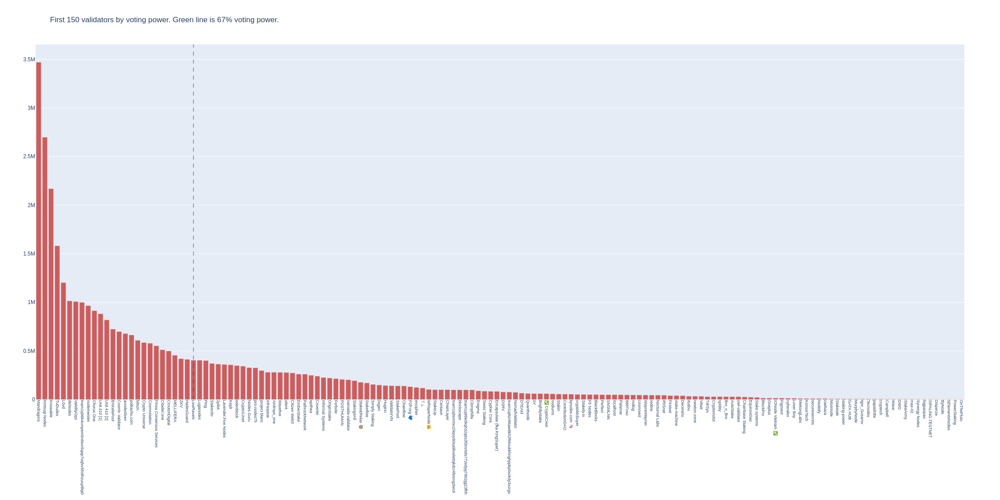

# Namada Mainnet Genesis files

The set of parameters and transactions that will create the namada genesis file.

If you have received an allocation, check the [docs on how to make a pre-genesis transaction.](https://docs.namada.net/networks/starting-network/genesis-flow/participants)

If you need help, feel free to [reach out on discord](https://discord.gg/AsPCKgW3)!

## Voting power distribution

## Validators

- address: `tnam1q8h9akjgy7s8zj7elj08d8lzrqr3w0cc9gplkaq2`
    - alias: `Unknown alias`
    - commission: `5.0%`
    - max commission rate change: `1.0%`
    - total voting power: `999995.0`
    - email: `hi@originstake.com`
    - website: `https://originstake.com`

- address: `tnam1qyl03jqx3nafc2dcjgymx8jmc75ex946v56wangr`
    - alias: `Unknown alias`
    - commission: `5.0%`
    - max commission rate change: `1.0%`
    - total voting power: `999990.0`
    - email: `tvboxsupreme@gmail.com`
    - website: `Unknown website`

- address: `tnam1q9whgzct6t2r62j7vyurc8djdfz406ejxquqz4pu`
    - alias: `Unknown alias`
    - commission: `5.0%`
    - max commission rate change: `1.0%`
    - total voting power: `999000.0`
    - email: `hidden@gm.co`
    - website: `https://mellifera.network/`

- address: `tnam1qyjs6q5sq7jhtnzg7ss837umyl0gugz7uuqfaus8`
    - alias: `Unknown alias`
    - commission: `5.0%`
    - max commission rate change: `1.0%`
    - total voting power: `999000.0`
    - email: `thenamidator@protonmail.com`
    - website: `Unknown website`

- address: `tnam1q80xwhew6mlgfecdzqp3ls5j0qgamjyhjv6urypv`
    - alias: `Unknown alias`
    - commission: `5.0%`
    - max commission rate change: `1.0%`
    - total voting power: `900000.0`
    - email: `antons.kurakins@crouton.digital`
    - website: `https://crouton.digital/`

- address: `tnam1q8vzxrxr37t7v7kgkugs4tsss4uf3l4cuy8zp7sh`
    - alias: `Unknown alias`
    - commission: `5.0%`
    - max commission rate change: `1.0%`
    - total voting power: `900000.0`
    - email: `hey@mail.com`
    - website: `https://mandragora.io`

- address: `tnam1q8lpfs90a5kjx83al0m9hg9w7v2u870nau4y3wyy`
    - alias: `Unknown alias`
    - commission: `5.0%`
    - max commission rate change: `1.0%`
    - total voting power: `900000.0`
    - email: `nick@totalgaming.io`
    - website: `Unknown website`

- address: `tnam1q97g220afjdfcyfhk7rsmyu46xn82malpgp03rtt`
    - alias: `Unknown alias`
    - commission: `5.0%`
    - max commission rate change: `1.0%`
    - total voting power: `10000.0`
    - email: `test1@gmail.com`
    - website: `Unknown website`

- address: `tnam1qx2hvawznw3kj63xl8smc65kw543e3t6h5lend0a`
    - alias: `Unknown alias`
    - commission: `5.0%`
    - max commission rate change: `1.0%`
    - total voting power: `10000.0`
    - email: `info@l0vd.com`
    - website: `https://chain-services.l0vd.com/`

- address: `tnam1qynlgtyxvv5apfpf23dfx2788jfv6uzwdqw0mvsv`
    - alias: `Unknown alias`
    - commission: `5.0%`
    - max commission rate change: `1.0%`
    - total voting power: `1000.0`
    - email: `truongquoctuan61@gmail.com`
    - website: `Unknown website`

- address: `tnam1qxf4u7cr7cv6r420yx9mhz2u9vgfefxh7g0txmyh`
    - alias: `Unknown alias`
    - commission: `5.0%`
    - max commission rate change: `1.0%`
    - total voting power: `50.0`
    - email: `admin`
    - website: `https://validatorvn.com`

